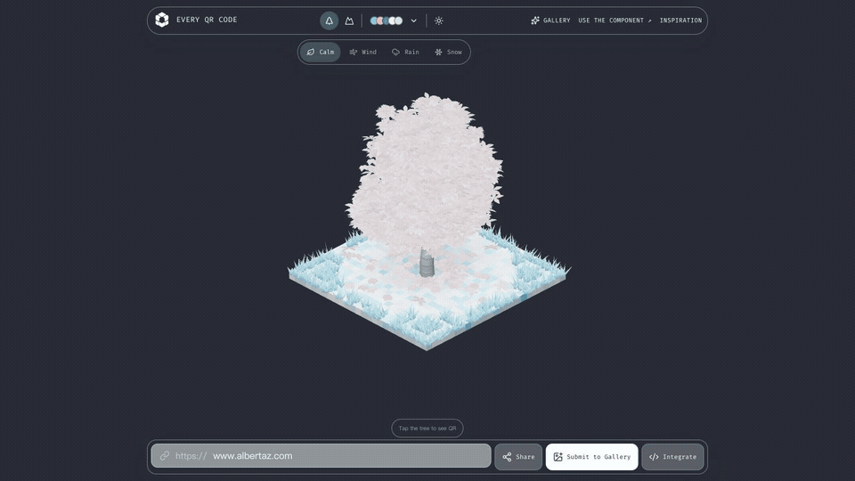

# Every QR Code



**Deterministic, scannable 3D QR worlds for React & Web Components.**

[Live Demo](https://every-qrcode.com/) ·
[React npm](https://www.npmjs.com/package/@every-qrcode/react) ·
[Web Component npm](https://www.npmjs.com/package/@every-qrcode/web-component)

```bash
pnpm add @every-qrcode/react
```

[](https://www.npmjs.com/package/@every-qrcode/react)
[](https://www.npmjs.com/package/@every-qrcode/web-component)
[](LICENSE)

Every QR Code turns a URL into a deterministic, scannable 3D world. The same normalized identity
always produces the same QR matrix and visual DNA. Switch between a living Tree or Terrain model
and the canonical QR code without changing the destination.

Use the React component, the framework-independent Web Component, or the lower-level TypeScript
and WebGPU packages. Rendering stays in the browser, with no telemetry or server calls.

## Why Every QR Code?

- **Scannable by design** — every world morphs into its canonical QR matrix.
- **Deterministic visual identity** — the same site or URL always grows the same world.
- **Two lazy 3D models** — Tree and Terrain shader bundles load only when selected.
- **React and Web Components** — use the same renderer across modern frontend stacks.
- **Graceful WebGPU fallback** — unsupported devices receive a static, scannable SVG QR code.
- **Privacy-friendly** — generation runs locally without analytics or network requests.

## React QR code component

```tsx
import { EveryQRCode } from "@every-qrcode/react";

export function WebsiteIdentity() {
  return <EveryQRCode url="https://example.com" />;
}
```

The component defaults to a Tree, site-level identity, 3D-first view, and click-to-reveal QR
interaction. Use `model="terrain"`, `initialView="qr"`, or `identityScope="url"` when needed.

## QR code Web Component

```bash
pnpm add @every-qrcode/web-component
```

```js
import "@every-qrcode/web-component/auto";
```

```html
<every-qr-code url="https://example.com"></every-qr-code>
```

## Packages

| Package                                                     | Purpose                                                  |
| ----------------------------------------------------------- | -------------------------------------------------------- |
| [`@every-qrcode/react`](packages/react)                     | React component and typed presentation API               |
| [`@every-qrcode/web-component`](packages/web-component)     | Native Custom Element with optional auto-registration    |
| [`@every-qrcode/core`](packages/core)                       | URL normalization, Link DNA, and canonical QR generation |
| [`@every-qrcode/renderer-webgpu`](packages/renderer-webgpu) | Lazy Tree and Terrain WebGPU renderer                    |

Product code normally installs only the React or Web Component package. The adapter packages pull
in the shared core and renderer automatically.

## Models and identity

- `model="tree"` renders the deterministic Tree form.
- `model="terrain"` renders the deterministic Terrain form.
- `identityScope="site"` is the default and gives every path on one hostname the same identity.
- `identityScope="url"` includes the full normalized URL in the identity.
- Both models morph to the same canonical QR matrix.

See [the package architecture](packages/README.md) and
[technical architecture](docs/technical-architecture.md) for internal ownership boundaries. The
[renderer model guide](docs/adding-renderer-model.md) lists the code and tests needed for a new
lazy model.

## Browser support

The interactive 3D view uses WebGPU. On devices where WebGPU initialization fails, the React and
Web Component adapters display a static SVG QR fallback, so the link remains scannable.

## Development

Requires Node.js 22+ and pnpm 10+.

```bash
pnpm install
pnpm dev
```

Before publishing:

```bash
pnpm test
pnpm typecheck
pnpm lint
pnpm build
pnpm format:check
```

## License

[MIT](LICENSE)
